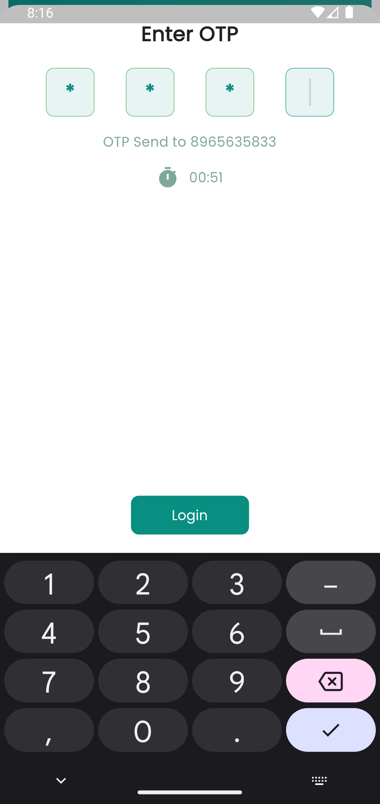

# Gameon

Gameon is an cricket sport ground schduling app.

<h6>
Its an assignment for internship and thus contains only UI part.
</h6>

## Version

Flutter: v3.3.3
Android SDK: v 33.0.0

## Setup

### Clone the Project

```bash
    git clone https://github.com/bhagwanZaki/Gameon.git
```

### Get the packages

```dart
    flutter pub get
```

## Output

### Splash Screen


### Login Screen

<table>
<tr>
<td> 

</td>
<td> 

</td>
</tr>
</table>

### OTP Verificaion Screen

<table>
<tr>
<td> 

</td>
<td> 

</td>
</tr>
</table>

### Home Page Screen

<table>
<tr>
<td> 

</td>
<td> 

</td>
</tr>
</table>

### Detail Page Screen

<table>
<tr>
<td> 

</td>
<td> 

</td>
</tr>
</table>
